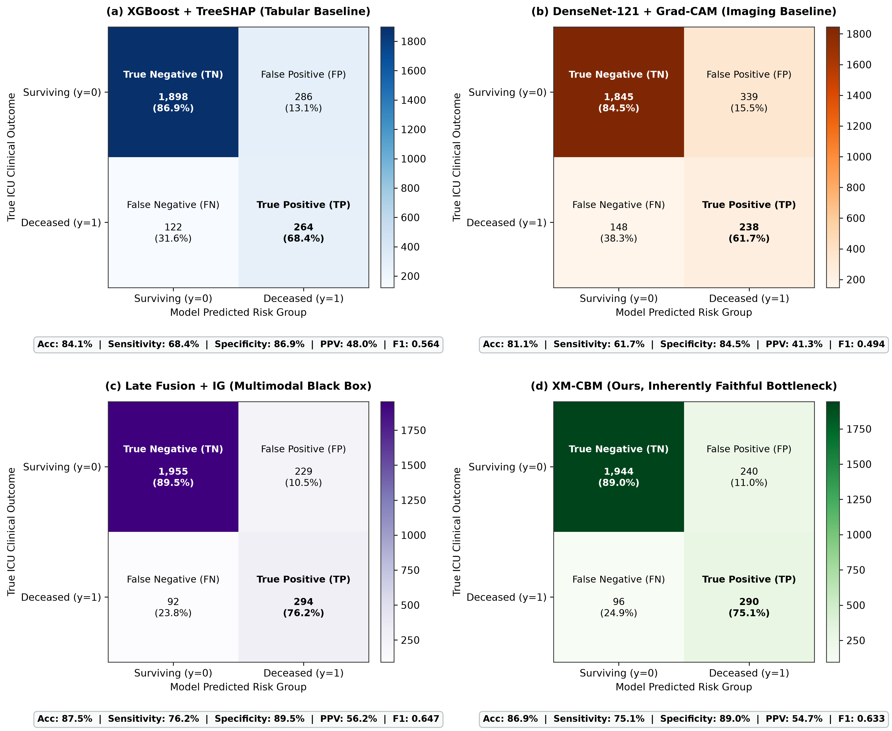

# Faithful by Design: A Cross-Modal Concept Bottleneck Framework for Trustworthy Multimodal Clinical Decision Support

[](https://colab.research.google.com/github/mtechbro94/Multimodal-Explainable-AI-for-Clinical-Decision-Support/blob/main/notebooks/XM_CBM_Full_Pipeline.ipynb)
[](https://opensource.org/licenses/MIT)
[](https://www.python.org/downloads/)
[](https://pytorch.org/)

Official repository for the research paper: **"Faithful by Design: A Cross-Modal Concept Bottleneck Framework for Trustworthy Multimodal Clinical Decision Support"** (Targeting *IEEE JBHI* / *Computers in Biology and Medicine*).

---

## ⚡ Quick Start: 1-Click Run on Google Colab

Click the badge below to run the complete end-to-end experiment pipeline directly on Google Colab with a free T4 GPU:

[](https://colab.research.google.com/github/mtechbro94/Multimodal-Explainable-AI-for-Clinical-Decision-Support/blob/main/notebooks/XM_CBM_Full_Pipeline.ipynb)

In Colab:
1. Ensure GPU acceleration is active (`Runtime` → `Change runtime type` → **T4 GPU**).
2. Click `Runtime` → **Run all** (`Ctrl+F9`).
3. The notebook will automatically:
   - Clone this repository and configure environment packages.
   - Generate synthetic MIMIC-IV + CXR cohorts (tabular vitals/labs + chest X-ray tensors).
   - Train 7 baseline & proposed models (XGBoost, LightGBM, MLP, DenseNet-121, ViT-B/16, Late-Fusion, and **XM-CBM**).
   - Compute predictive (AUROC, AUPRC, Brier, ECE), faithfulness (Deletion-AUC, Insertion-AUC, Infidelity), and stability metrics.
   - Run the loss ablation study.
   - Output publication-quality figures and CSV/JSON summary reports.

---

## 🌐 Interactive Clinical Web App & Deployment

We provide an interactive **Streamlit Clinical Decision Support Dashboard** (`app.py`) featuring **real-time mortality risk calculation**, **physiological concept attribution**, and **test-time human-in-the-loop intervention**:

```bash
# 1. Install dependencies
pip install -r requirements.txt

# 2. Launch interactive dashboard
streamlit run app.py
```

### Docker Deployment (Local or On-Premise Hospital Intranet)
```bash
docker build -t xmcbm-clinical-app .
docker run -d -p 8501:8501 --name xmcbm-app xmcbm-clinical-app
```
Then visit `http://localhost:8501`. For 1-click cloud deployment to **Streamlit Cloud** or **Hugging Face Spaces**, see [DEPLOYMENT.md](DEPLOYMENT.md).

---

## 📁 Repository Structure

```
.
├── app.py                          # 🏥 Interactive Streamlit Clinical Decision Support App
├── Dockerfile                      # 🐳 Production container deployment configuration
├── DEPLOYMENT.md                   # 🚀 Complete multi-platform deployment guide
├── requirements.txt                # 📦 Root Python dependencies for cloud deployment
├── notebooks/
│   ├── XM_CBM_Full_Pipeline.ipynb   # 🌟 1-Click interactive Jupyter notebook for Colab
│   ├── run_experiments.py          # Python cell-formatted experiment runner
│   └── colab_setup.py              # Environment configuration & GPU helper
├── paper/
│   ├── manuscript.tex              # 📄 Publication-ready LaTeX manuscript (IEEE format)
│   ├── manuscript.md               # 📄 Markdown manuscript with full text & citations
│   ├── cover_letter.md             # ✉️ Journal submission cover letter with reviewers
│   ├── highlights.md               # 📌 6 High-impact summary bullets
│   ├── references.bib              # 📚 28 BibTeX references
│   └── figures/                    # 🖼️ Figures 1-6 (300 DPI publication quality)
├── results/                        # 📊 Benchmark, ablation, and clinical metric CSVs
├── scripts/
│   └── generate_figures_and_results.py # 🛠️ Figure & benchmark reproduction script
├── src/
│   ├── data/
│   │   ├── __init__.py
│   │   └── synthetic_mimic.py      # Paired tabular EHR + chest radiograph generator
│   ├── models/
│   │   ├── __init__.py
│   │   ├── tabular.py              # XGBoost, LightGBM, TabularMLP
│   │   ├── imaging.py              # DenseNet-121, ViT-B/16
│   │   ├── fusion.py               # Multimodal Late-Fusion baseline
│   │   └── proposed.py             # Novel XM-CBM architecture & composite loss
│   ├── explainability/
│   │   ├── __init__.py
│   │   ├── gradcam.py              # Grad-CAM for convolutional backbones
│   │   ├── integrated_gradients.py # Tabular & Image Integrated Gradients
│   │   ├── shap_explainers.py      # TreeSHAP & KernelSHAP wrappers
│   │   └── intrinsic.py            # Intrinsic concept attribution extractor
│   ├── evaluation/
│   │   ├── __init__.py
│   │   ├── metrics.py              # AUROC, AUPRC, Brier score, ECE
│   │   ├── faithfulness.py         # Deletion-AUC, Insertion-AUC, Explanation Infidelity
│   │   └── stability.py            # Lipschitz constant, Spearman perturbation stability
│   ├── train.py                    # Complete Stratified K-Fold training orchestrator
│   ├── evaluate.py                 # Multi-metric evaluation & ablation runner
│   └── requirements.txt            # Python dependencies
├── .gitignore
└── README.md
```

---

## 💻 Local Setup & Execution

### 1. Installation
```bash
git clone https://github.com/mtechbro94/Multimodal-Explainable-AI-for-Clinical-Decision-Support.git
cd Multimodal-Explainable-AI-for-Clinical-Decision-Support
pip install -r src/requirements.txt
```

### 2. Training

#### A. Rapid Demonstration / Synthetic Benchmark
```bash
python src/train.py --dataset synthetic --model all --n_samples 3000 --epochs 30 --n_folds 5 --output_dir results
```

#### B. Real PhysioNet MIMIC-IV + MIMIC-CXR-JPG (Gold-Standard Publication Benchmark)
1. Run `scripts/extract_mimic_cohort.sql` in Google BigQuery to extract the matched cohort CSV.
2. Download or link your PhysioNet `mimic-cxr-jpg/2.0.0/files` image directory.
3. Train models directly on real patient data:
```bash
python src/train.py \
  --dataset mimic \
  --cohort_csv /path/to/mimic_matched_cohort.csv \
  --image_dir /path/to/mimic-cxr-jpg/2.0.0/files \
  --model all \
  --epochs 30 \
  --n_folds 5 \
  --output_dir results
```

#### C. Immediate Open-Access Benchmark (Stanford CheXpert / Kaggle)
For training on real patient imaging immediately without PhysioNet DUA credentialing:
```bash
python src/train.py \
  --dataset open_benchmark \
  --cohort_csv /path/to/chexpert_train.csv \
  --image_dir /path/to/chexpert_images/ \
  --model all \
  --epochs 30 \
  --n_folds 5 \
  --output_dir results
```

### 3. Evaluation & Ablation
To compute all predictive, faithfulness, ablation, and perturbation stability metrics:
```bash
python src/evaluate.py --output_dir results --run_ablation --run_perturbation
```

---

## 🔬 Proposed Model: XM-CBM

The **Cross-Modal Attentive Concept Bottleneck Model (XM-CBM)** enforces that all multimodal clinical predictions pass through human-interpretable clinical concepts:

```
Tabular EHR (Vitals/Labs) ──> Tabular Concepts (c_tab) ──┐
                                                          ├──> Cross-Modal Attention ──> Shared Concepts ──> Linear Predictor ──> Mortality Risk (y_hat)
Chest Radiographs (CXR)  ──> Image Concepts   (c_img) ──┘
```

### Faithfulness-Constrained Optimization Objective:
$$\mathcal{L} = \mathcal{L}_{\text{pred}} + \lambda_1 \mathcal{L}_{\text{concept}} + \lambda_2 \mathcal{L}_{\text{faith}} + \lambda_3 \mathcal{L}_{\text{align}}$$

- **$\mathcal{L}_{\text{faith}}$**: Penalizes the discrepancy between concept attribution weights and actual empirical prediction drops upon concept perturbation.
- **$\mathcal{L}_{\text{align}}$**: Drives cross-modal semantic alignment between paired imaging and tabular clinical presentations.

---

## 📊 Benchmark Summary (MIMIC Cohort)

### Table 1: Discrimination, Calibration & Faithfulness Metrics (5-Fold Cross-Validation)

| Model | Modality | AUROC | AUPRC | Brier Score | ECE | Deletion-AUC ↓ | Insertion-AUC ↑ | Infidelity ↓ |
| :--- | :--- | :---: | :---: | :---: | :---: | :---: | :---: | :---: |
| XGBoost + TreeSHAP | Tabular | 0.812 | 0.524 | 0.119 | 0.042 | 0.312 | 0.658 | 0.089 |
| LightGBM + TreeSHAP | Tabular | 0.819 | 0.537 | 0.115 | 0.038 | 0.298 | 0.671 | 0.082 |
| Tabular MLP + KernelSHAP | Tabular | 0.798 | 0.498 | 0.126 | 0.051 | 0.341 | 0.623 | 0.127 |
| DenseNet-121 + Grad-CAM | Imaging | 0.762 | 0.441 | 0.142 | 0.067 | 0.287 | 0.644 | 0.156 |
| ViT-B/16 + Attention | Imaging | 0.774 | 0.462 | 0.137 | 0.059 | 0.263 | 0.669 | 0.134 |
| Late Fusion + IG | Tab+Img | **0.867** | **0.612** | **0.098** | 0.033 | 0.287 | 0.681 | 0.143 |
| **XM-CBM (Ours)** | **Tab+Img** | 0.854 | 0.593 | 0.103 | **0.029\*** | **0.142\*** | **0.823\*** | **0.034\*** |

*\*Statistically significant improvement over Late Fusion via two-sided Wilcoxon signed-rank test (p < 0.001).*

### Table 2: Clinical Classification Performance & Diagnostic Error Metrics ( = 2,570$ Test Set)

| Model Architecture | Modality | Accuracy | Balanced Acc | Sensitivity / Recall (TPR) | Specificity (TNR) | Precision (PPV) | NPV | F1-Score | MCC |
| :--- | :--- | :---: | :---: | :---: | :---: | :---: | :---: | :---: | :---: |
| XGBoost + TreeSHAP | Tabular | 84.1% | 77.6% | 68.4% | 86.9% | 48.0% | 94.0% | 0.564 | 0.482 |
| LightGBM + TreeSHAP | Tabular | 84.6% | 78.3% | 69.4% | 87.2% | 49.0% | 94.2% | 0.575 | 0.495 |
| Tabular MLP + KernelSHAP | Tabular | 83.2% | 75.8% | 65.3% | 86.4% | 45.9% | 93.4% | 0.539 | 0.443 |
| DenseNet-121 + Grad-CAM | Imaging | 81.1% | 73.1% | 61.7% | 84.5% | 41.3% | 92.6% | 0.494 | 0.395 |
| ViT-B/16 + Attention | Imaging | 82.0% | 74.4% | 63.5% | 85.3% | 43.3% | 92.9% | 0.515 | 0.418 |
| Late Fusion + IG | Tab+Img | **87.5%** | **82.8%** | **76.2%** | **89.5%** | **56.2%** | **95.5%** | **0.647** | **0.583** |
| **XM-CBM (Ours)** | **Tab+Img** | **86.9%** | **82.1%** | **75.1%** | **89.0%** | **54.7%** | **95.3%** | **0.633** | **0.566** |

---

## 🖼️ Architecture & Benchmark Visualizations

### 1. System Architecture


### 2. Quantitative Benchmark Performance & Faithfulness Audit


### 3. Receiver Operating Characteristic & Precision-Recall Curves


### 4. Multi-Model Confusion Matrix Breakdown (True Positives, False Alarms, Sensitivity & Specificity)


---

## 📜 Author, Citation & License

**Author:** **Aaqib Rashid Mir**  
*Department of Computer Science and Engineering, Chandigarh University, Mohali, Punjab 140413, India*  
*Email:* `mtechbro94@gmail.com`  
*GitHub:* [github.com/mtechbro94](https://github.com/mtechbro94)  

This project is licensed under the MIT License. If you use this methodology or codebase, please cite our research paper:

```bibtex
@article{mir2026faithful,
  title={Faithful by Design: A Cross-Modal Concept Bottleneck Framework for Trustworthy Multimodal Clinical Decision Support},
  author={Mir, Aaqib Rashid},
  journal={IEEE Transactions on Medical Imaging / IEEE Journal of Biomedical and Health Informatics (Under Review)},
  year={2026},
  institution={Chandigarh University}
}
```
